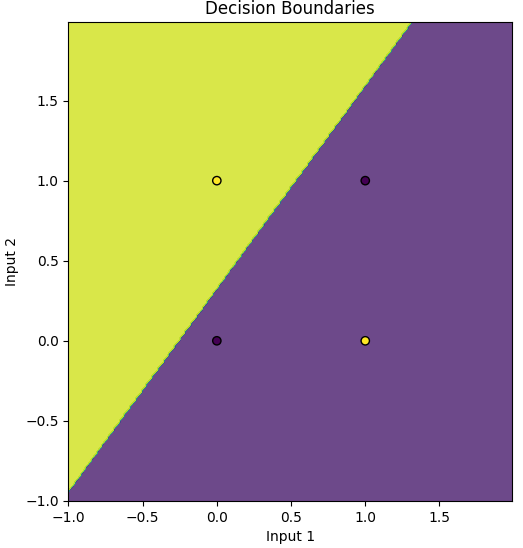
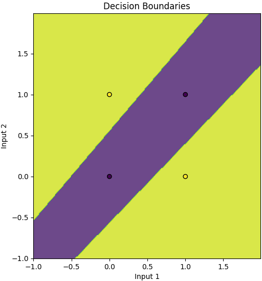
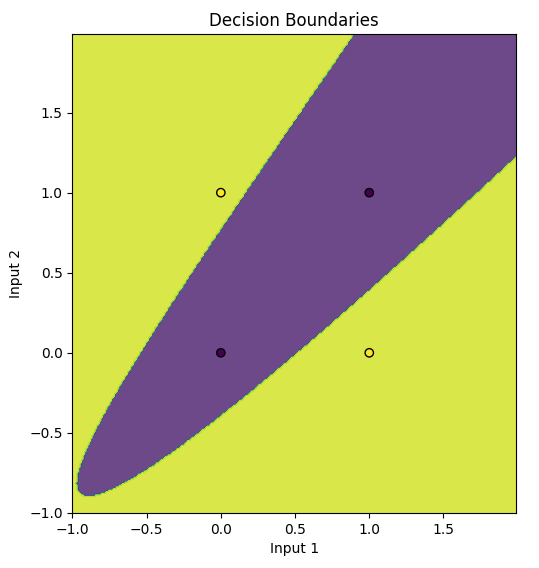
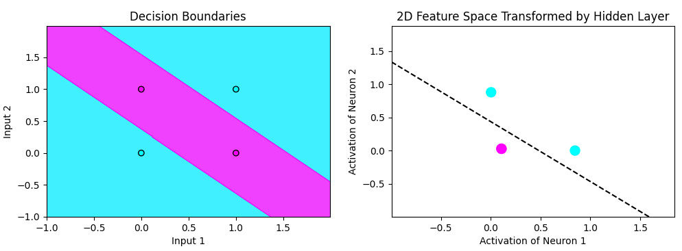
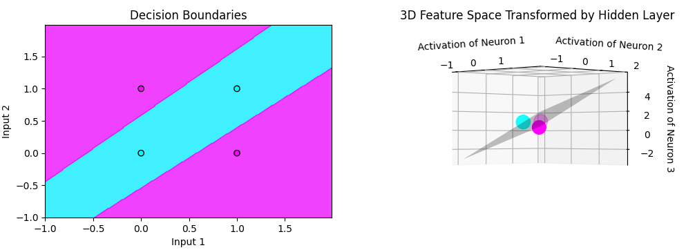

# Network-Visualizers
Personal implementations of various networks without any ML libraries and visualizations for each. (Currently only XOR implemented)

## Table of Contents

- [Setup and Installation](#setup-and-installation)
- [Handling CLI Arguments](#handling-cli-arguments)
  - [Example Usage](#example-usage)
- [Currently Implemented](#currently-implemented)
  - [XOR (Exclusive OR) Problem Neural Network](#xor-exclusive-or-problem-neural-network)
  - [Convolutional Neural Network - Mnist Handwritten Digits](#convolutional-neural-network-mnist-handwritten-digits)
- [Planned Implementations](#planned-implementations)
- [Contributing](#contributing)
---
## Setup and Installation

1. Clone the repository:
    `git clone https://github.com/yourusername/Network-Visualizers.git`
    `cd Network-Visualizers`

2. Install the required dependencies (virtual environment recommended):
    `python -m venv venv`
    `.\venv\Scripts\activate`
    `pip install -r requirements.txt`

3. Run the desired neural network visualizer:

    - **XOR Problem**:
    `python main.py --xor`

    - **MNIST Digit Recognition (Planned)**:
    `python main.py --mnist_digits`

4. To exit training early, press 'q'

## Handling CLI Arguments

The script accepts several command-line arguments to control the visualization and configuration of the networks:

- `--xor`: Run the XOR classifier
- `-hn`, `--hidden_neurons`: Number of neurons in the hidden layer (default is 3)
- `-ner`, `--num_epochs_refresh_visualizer`: Number of epochs per refreshing of visualizers (affects the speed of training; default is 100)
- `-md`, `--mnist_digits`: Run the MNIST digit classifier (planned implementation)

### Example Usage

To run the XOR neural network with a custom number of hidden neurons and visualizer refresh rate:

`python main.py --xor -hn 3 -ner 200`

**Note** It is most useful to run the XOR network with 2 or 3 hidden neurons, as those allow you to see the feature space mapping of the input points. Beyond 3 dimensions it is not feasible for us to visualize, the feature space plot is omitted. However the network will still run and train and other plots show.

## Currently Implemented Network Backgrounds:
### XOR (Exclusive OR) Problem Neural Net
Simple neural network with 3 layers (1 input, 1 hidden, 1 output) to solve the XOR gate problem.
The XOR problem is a fundamental in machine learning, introducing the concept non linearly separable classification

XOR takes two binary inputs and outputs a single binary output as shown in the following truth table:
```
    a   |   b   |   y
-------------------------
    0   |   0   |   0       # if both inputs are false, output is false
    0   |   1   |   1       # if one input is false and one true, output is true
    1   |   0   |   1       # if one input is true and one false, output is true
    1   |   1   |   0       # if both inputs are true, output is false
```

Plotting the inputs and outputs of this truth table results in something like this:



You can see in the above plot, that there is no way to draw a single line to separate the two categories.

However if we draw two lines we can separate categories effectively


*Conceptually speaking* the equivalent to drawing two lines is to use two hidden neurons to introduce non linear relationships.

However, we are not technically drawing 2 separate lines, rather having the network transform points to a new 2D space (feature space) where the points *become* linearly separable, and then interpreting this linear separation as it relates to our input space to make a decision (and to visualize the decision boundaries). This mapping is created from the non-linearities of the activation functions. When we interpret the linear decision boundary that was found in this new 2D space as it relates to our original input space, the boundary is now curved and *resembles* a 2nd degree polynomial, however it is technically a linear piecewise function found in the feature space, where each neuron contributes a piece of the piecewise function. This curved decision boundary is better demonstrated in the intermediate training steps as it starts to figure out the solution, where we can see an accurate boundary *starting* to form.



In the figure below we can see the plot showing the network has found a solution and is interpreted in our input space, and how it relates to the feature space where we found a linearly separable solution. 



**Note** 2 of the True outputs (pink) have been transformed such that they essentially overlap eachother.

This visualization works as we are transforming our input space from 2D to another space still in 2D. 

If we used 3 hidden neurons, we'd be transforming the points into 3D and find a plane that separates the points, then interpreting that transformation back in our original 2D input space for an output of the decision. This pattern extends s.t. n hidden neurons will map points to n dimensions.

We can see how 3 hidden neurons gives a 3D feature space below



---

### Convolutional Neural Network - Mnist Handwritten Digits
**THIS IS A WORK IN PROGRESS**

**Convolution Forward Pass**
$$
O_k^i(y,x) = \sum_{c=0}^{C_in - 1} \sum_{p=0}^{F - 1} \sum_{q=0}^{F - 1} X_c^i(y \cdot S + p, x \cdot S + q) \cdot W_c^k(p,q) + b^k
$$
Where:
    - $O_k^i(y,x)$ is the output at position $(y,x)$ for image $i$ and filter $k$.
    - $X_c^i$ is the input data for image $i$ and input channel $c$.
    - $W_c^k$ is the filter weights for filter $k$ and input channel $c$.
    - $b^k$ is the bias for filter $k$.
    - $F$ is the filter size.
    - $S$ is the stride.
    - $C_{in}$ is the number of input channels.

**Convolution Backward Pass**
The various gradient formulas arise from applying chain rule to the convolution operation above.

Gradient w.r.t the bias term
$$
\frac{\partial L}{\partial b^k} = \sum_i \sum_y \sum_x \frac{\partial L}{\partial O_i^k(y,x)} \cdot \frac{\partial O_i^k(y,x)}{\partial b^k} = \sum_i \sum_y \sum_x \frac{\partial L}{\partial O_i^k(y,x)}
$$


**Gradient w.r.t the weights**
The weights of each filter are involved in attaining the output through its multiplication with the output patches. So the gradient of the loss with respect to a weight $W_c^k(p,q)$ in a filter k is the sum over all patches where that weight contributed to the output, times the upstream gradient $\frac{\partial L}{\partial O_k^i(y,x)}$

$$
\frac{\partial L}{\partial W_c^k(p,q)} = \sum_i \sum_y \sum_x \frac{\partial L}{\partial O_k^i(y,x)} \cdot \frac{\partial O_k^i(y,x)}{\partial W_c^k(p,q)} = \sum_i \sum_y \sum_x \frac{\partial L}{\partial O_k^i(y,x)} \cdot X_c^i(y \cdot S + p, x \cdot S + q)
$$


**Gradient w.r.t the inputs**
Gradient of the input is found by considering how each input pixel contributes to multiple overlapping output patches. The gradient with respect to a pixel $X_c^i(m,n)$ is the sum of all gradients from output feature maps that were influenced by that pixel. Keeping in mind that the derivative of the output with respect to the input is just the weight at that corresponding position in the filter (hence the simplification on the right).
$$
\frac{\partial L}{\partial X_c^i(m,n)} = \sum_k \sum_y \sum_x \frac{\partial L}{\partial O_k^i(y,x)} \cdot \frac{\partial O_k^i(y,x)}{\partial X_c^i(m,n)} = \sum_k \sum_y \sum_x \frac{\partial L}{\partial O_k^i(y,x)} \cdot W_c^k(p,q)
$$
Where $m$ and $p$ are the current filter coordinates, also found in the above forward pass:
    - $m = y \cdot S + p$
    - $n = x \cdot S + q$


---

## Planned implementations
- MNIST hand written numbers
- attention model predictions

## Contributing
Feel free to contribute by forking the repository, making changes, and submitting a pull request.
