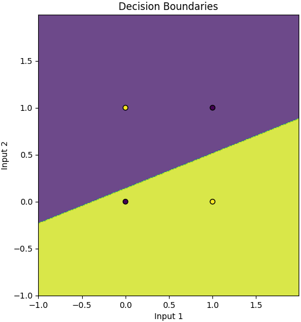

# Network-Visualizers
Personal implementations of various networks without any ML libraries and visualizations for each. (Currently only XOR implemented)

## Table of Contents

- [Setup and Installation](#setup-and-installation)
- [Handling CLI Arguments](#handling-cli-arguments)
  - [Example Usage](#example-usage)
- [Currently Implemented Network Backgrounds](#currently-implemented-network-backgrounds)
  - [XOR (Exclusive OR) Problem Neural Net](#xor-exclusive-or-problem-neural-net)
  - [Convolutional Neural Network - Mnist Handwritten Digits](#convolutional-neural-network---mnist-handwritten-digits)
- [Planned Implementations](#planned-implementations)
- [Contributing](#contributing)
---
## Setup and Installation

1. Clone the repository:
    - `git clone https://github.com/yourusername/Network-Visualizers.git`
    - `cd Network-Visualizers`

2. Install the required dependencies (virtual environment recommended):
    - `python -m venv venv`
    - Windows: `.\venv\Scripts\activate` Mac/Linux: `source venv/bin/activate`
    - `pip install -r requirements.txt`

3. Run the desired neural network visualizer:

    - **XOR Problem**:
    `python main.py --xor`

    - **MNIST Digit Recognition (WIP)**:
    `python main.py --mnist`

4. To exit training early, press 'q'

## Handling CLI Arguments

The script accepts several command-line arguments to control the visualization and configuration of the networks:

- `--xor`: Run the XOR classifier
    - `-hn`, `--hidden_neurons`: Number of neurons in the hidden layer (default is 3)
    - `-ner`, `--num_epochs_refresh_visualizer`: Number of epochs per refreshing of visualizers (affects the speed of training; default is 100 for xor)
    
- `-md`, `--mnist_digits`: Run the MNIST digit classifier (planned implementation)

- `e`, `--epochs`: Number of epochs to train selected model

**Note:** args shown above that are indented in the list indicate that they are only relevant to the parent arg. i.e. `-hn` is only used for `--xor`

### Example Usage

To run the XOR neural network with a custom number of hidden neurons, epochs, and visualizer refresh rate:

`python main.py --xor -hn 3 -ner 200 -e 40000`

**Note** It is most useful to run the XOR network with 2 or 3 hidden neurons, as those allow you to see the feature space mapping of the input points. Beyond 3 dimensions it is not feasible for us to visualize, so the feature space plot is omitted. However the network will still run and train with other plots showing.

## Currently Implemented Network Backgrounds:
### XOR (Exclusive OR) Problem Neural Network Deep Dive

[](https://www.youtube.com/watch?v=zGUs17-CcHU)


Simple neural network with 3 layers (1 input, 1 hidden, 1 output) to solve the XOR gate problem.
The XOR problem is a fundamental in machine learning, introducing the concept non linearly separable classification

**A Brief Overview of Neural Networks Before We Begin**
A neural network is a computational model inspired by the human brain's structure. It consists of layers of interconnected neurons (also called nodes), where each neuron processes input data and passes the result to the next layer. The network learns by adjusting the weights and biases associated with these connections to minimize the difference between its predictions and the actual outputs.

An XOR logic gate takes two binary inputs and outputs a single binary output as shown in the following truth table:
```
    a   |   b   |   y
-------------------------
    0   |   0   |   0       # if both inputs are false, output is false
    0   |   1   |   1       # if one input is false and one true, output is true
    1   |   0   |   1       # if one input is true and one false, output is true
    1   |   1   |   0       # if both inputs are true, output is false
```

Plotting the inputs and outputs of this truth table results in something like this:



You can see in the above plot, that there is no way to draw a single line to separate the two categories.

However if we draw two lines we can separate categories effectively


*Conceptually speaking* the equivalent to drawing two lines is to use two hidden neurons to introduce non linear relationships.

However, we are not technically drawing 2 separate lines, rather having the network transform points to a new 2D space (feature space) where the points *become* linearly separable, and then interpreting this linear separation as it relates to our input space to make a decision (and to visualize the decision boundaries). This mapping is created from the non-linearities of the activation functions. When we interpret the linear decision boundary that was found in this new 2D space as it relates to our original input space, the boundary is now curved and *resembles* a 2nd degree polynomial, however it is technically a linear piecewise function found in the feature space, where each neuron contributes a piece of the piecewise function. This curved decision boundary is better demonstrated in the intermediate training steps as it starts to figure out the solution, where we can see an accurate boundary *starting* to form.


In the figure below we can see the plot showing the network has found a solution and is interpreted in our input space, and how it relates to the feature space where we found a linearly separable solution. 


**Note** 2 of the True outputs (pink) have been transformed such that they essentially overlap eachother.

This visualization works as we are transforming our input space from 2D to another space still in 2D. 

If we used 3 hidden neurons, we'd be transforming the points into 3D and find a plane that separates the points, then interpreting that transformation back in our original 2D input space for an output of the decision. This pattern extends s.t. n hidden neurons will map points to n dimensions.

We can see how 3 hidden neurons gives a 3D feature space below


Now that we have a conceptual understanding, let's now dive into the math behind this to build the bridge between theory and application.

**Architecture**

Our neural network has the following structure:

- Input Layer: 2 neurons (for inputs $x_1$ and $x_2$)
- Hidden Layer: $n$ neurons (we'll use 3 for demonstration purposes)
- Output Layer: 1 neuron (for the predicted output $\hat{y}$)

This architecture allows the network to capture the non-linear relationships inherent in the XOR problem.


**Activation**

Activation functions introduce non-linearity into the network, enabling it to learn complex patterns by 'activating' the neurons in both the hidden and output layers.
A commonly used activation function for neural networks is the **Sigmoid function**

$$
\sigma(z) = \frac{1}{1 + e^{-z}}
$$


**Forward Propagation**

Forward propagation is the process of calculating the output of the neural network given the inputs. It involves computing the activations of each neuron layer by layer.
For each hidden neuron $h_j$ where j is an index of a hidden neuron, we take the weighted sum of its inputs, which are initialized randomly as small numbers (between 0 and 1) for simplicity.
The weighted sum is as follows:

$$
z_j^{(1)} = w_{j1}^{(1)} x_1 + w_{j2}^{(1)} x_2 + w_{j3}^{(1)} x_3 + b_j^{(1)}
$$

Where:
- $w_{j1}^{(1)}$ is the weight from the input neuron $i$ to hidden neuron $j$
- $b_j^{(1)}$ is the bias term for hidden neuron $j$
- The $1$ superscript is the index of the layer (0 is input, 1 is hidden, 2 is output)

This weighted sum is then passed through the sigmoid activation given above:

$$
a_j^{(1)} = \sigma\left( z_j^{(1)} \right)
$$

From here we have each neuron's activation value. These activated neurons then have a weighted sum again to feed to the output neuron (layer index of 2)

$$
z^{(2)} = \sum_{j=1}^{n=3} w_j^{(2)} a_j^{(1)} + b^{(2)}
$$

And once again this weighted sum is then activated to give us a final output prediction value, which ideally is close to 1 or 0 (True or False)

$$
\hat{y} = \sigma\left( z^{(2)} \right)
$$


**Cost Function / Error**

The cost function quantifies the error between the network's predictions and the actual outputs. We use the Mean Squared Error (MSE):

$$
J = \frac{1}{2} (\hat{y} - y)^2
$$

Where $y$ is the actual output (aka ground truth) and $\hat{y}$ is the predicted value


**Backward Propagation**

Backward propagation calculates the gradients of the cost function with respect to each weight and bias, allowing us to individually update them in a way that minimizes the cost.


1. Output Layer Gradient
The output neuron gradient quantifies how far off out predicted output is from the actual output

$$
\delta^{(2)} = (\hat{y} - y) \cdot \sigma'\left( z^{(2)} \right)
$$

Where $\sigma'\left( z^{(2)} \right)$ is the derivative of the sigmoid function evaluated at $z^{(2)}$ given as:

$$
\sigma'(z) = \sigma(z) (1 - \sigma(z))
$$

Now with the error we can find the gradient of the output layer. The gradient of the cost function w.r.t the output weight $w_j^{(2)}$ and bias $b^{(2)}$ is as follows:

$$
\frac{\partial J}{\partial w_j^{(2)}} = \delta^{(2)} \cdot a_j^{(1)} \newline
\frac{\partial J}{\partial b^{(2)}} = \delta^{(2)}
$$


2. Hidden Layer Error
The error term for each hidden neuron $h_j$ is influenced by the errors in the subsequent layer:

$$
\delta_j^{(1)} = \delta^{(2)} \cdot w_j^{(2)} \cdot \sigma'\left( z_j^{(1)} \right)
$$

And again let's find the gradient of now the hidden layer weights and biases similarly to how we did for the ouput layer.

$$
\frac{\partial J}{\partial w_{ji}^{(1)}} = \delta_j^{(1)} \cdot x_i \newline
\frac{\partial J}{\partial b_j^{(1)}} = \delta_j^{(1)}
$$


3. Parameter Updates
With the gradients calculated, we use Gradient Descent to update the parameters of our network. This is best thought of as takking a small step down towards a minimum in the gradient. Keep in mind these gradients generate a sort of wavy surface, where we want to be as low as possible in. The lower we are in this gradient, the less error we have.

$$
\theta \leftarrow \theta - \eta \frac{\partial J}{\partial \theta}
$$

Where $\theta$ represents some weight or bias in the network, and $\eta$ is the learning rate, which controls how big of a step we take

More explicitly:

$$
w_j^{(2)} \leftarrow w_j^{(2)} - \eta \frac{\partial J}{\partial w_j^{(2)}}
$$

The same process follows for the bias:

$$
b^{(2)} \leftarrow b^{(2)} - \eta \frac{\partial J}{\partial b^{(2)}}
$$

We then repeat this step for the hidden neurons as well:

$$
w_{ji}^{(1)} \leftarrow w_{ji}^{(1)} - \eta \frac{\partial J}{\partial w_{ji}^{(1)}} \newline
b_j^{(1)} \leftarrow b_j^{(1)} - \eta \frac{\partial J}{\partial b_j^{(1)}}
$$

By integrating these mathematical principles into our code, we create a neural network that effectively learns to solve the XOR problem. Understanding the math behind the network not only demystifies how neural networks function but also empowers you to modify and extend the network for more complex tasks.

**Key Takeaways**
- Learning: The network learns by adjusting weights and biases to minimize the cost function.
- Error Signals: Errors are propagated backward to update parameters in earlier layers.
- Non-Linear Transformation: Hidden layers transform inputs into a space where linear separation is possible.
- Optimization: Gradient descent is used to find the set of parameters that minimize the cost.


---

### Convolutional Neural Network - Mnist Handwritten Digits
**THIS IS A WORK IN PROGRESS**
Here is a list of steps I outlined for this part of project, and the status of their completion, which should indicate the progress.
- [x] Code to download, check hash, and prep data to send to cnn
- [x] Define class structure and base layers, plan and organize files
- [x] Implement Conv2D layer
- [x] Xavier/Glorot weight initializations
- [x] Tests for Conv2D forward and backward
- [x] Implement ReLU and Softmax activation layers
- [x] Tests for activation layers
- [x] Implement helping layers (flatten and pooling)
- [x] Tests for helping layers
- [x] implement dense layer and derive gradients
- [x] tests for dense layer
- [x] implement CNN class training loop and layer formation
- [x] save resulting model
- [x] report more metrics while training and post training
- [x] add validation to training loop
- [x] batch images instead of updating weights on all
- [x] stochastic gradient descent instead of full GD
- [x] implement the adam optimizer (or similar)
- [x] stratified splitting of train/validation data
- [ ] scale images down to 10 x 10
- [ ] other optimizations/simplifications?
- [ ] setup pygame visuals backend
- [ ] visualize optimizer (what the lr is set to currently)
- [ ] filter pass live visual for sample image in training with weight and pixel values on top of filter/image
- [ ] live confusion matrix on validation images
- [ ] loop that shows images in dataset and heatmap of neurons' activations in all layers showing connections to which neurons are determining outputs for each image (can be done on trained model or validation images)
- [ ] other visuals?

**Convolution Forward Pass**

$$
O_k^i(y,x) = \sum_{c=0}^{C_in - 1} \sum_{p=0}^{F - 1} \sum_{q=0}^{F - 1} X_c^i(y \cdot S + p, x \cdot S + q) \cdot W_c^k(p,q) + b^k
$$

Where:
- $O_k^i(y,x)$ is the output at position $(y,x)$ for image $i$ and filter $k$.
- $X_c^i$ is the input data for image $i$ and input channel $c$.
- $W_c^k$ is the filter weights for filter $k$ and input channel $c$.
- $b^k$ is the bias for filter $k$.
- $F$ is the filter size.
- $S$ is the stride.
- $C_{in}$ is the number of input channels.

**Convolution Backward Pass**
The various gradient formulas arise from applying chain rule to the convolution operation above.

Gradient w.r.t the bias term

$$
\frac{\partial L}{\partial b^k} = \sum_i \sum_y \sum_x \frac{\partial L}{\partial O_i^k(y,x)} \cdot \frac{\partial O_i^k(y,x)}{\partial b^k} = \sum_i \sum_y \sum_x \frac{\partial L}{\partial O_i^k(y,x)}
$$


**Gradient w.r.t the weights**
The weights of each filter are involved in attaining the output through its multiplication with the output patches. So the gradient of the loss with respect to a weight $W_c^k(p,q)$ in a filter k is the sum over all patches where that weight contributed to the output, times the upstream gradient $\frac{\partial L}{\partial O_k^i(y,x)}$

$$
\frac{\partial L}{\partial W_c^k(p,q)} = \sum_i \sum_y \sum_x \frac{\partial L}{\partial O_k^i(y,x)} \cdot \frac{\partial O_k^i(y,x)}{\partial W_c^k(p,q)} = \sum_i \sum_y \sum_x \frac{\partial L}{\partial O_k^i(y,x)} \cdot X_c^i(y \cdot S + p, x \cdot S + q)
$$


**Gradient w.r.t the inputs**
Gradient of the input is found by considering how each input pixel contributes to multiple overlapping output patches. The gradient with respect to a pixel $X_c^i(m,n)$ is the sum of all gradients from output feature maps that were influenced by that pixel. Keeping in mind that the derivative of the output with respect to the input is just the weight at that corresponding position in the filter (hence the simplification on the right).

$$
\frac{\partial L}{\partial X_c^i(m,n)} = \sum_k \sum_y \sum_x \frac{\partial L}{\partial O_k^i(y,x)} \cdot \frac{\partial O_k^i(y,x)}{\partial X_c^i(m,n)} = \sum_k \sum_y \sum_x \frac{\partial L}{\partial O_k^i(y,x)} \cdot W_c^k(p,q)
$$

Where $m$ and $p$ are the current filter coordinates, also found in the above forward pass:
- $m = y \cdot S + p$
- $n = x \cdot S + q$


---

## Planned implementations
- MNIST hand written numbers -> CNN
- random forest visuals, showing multiple trees in ensemble converging on decision
- attention model predictions

## Contributing
Feel free to contribute by forking the repository, making changes, and submitting a pull request.
