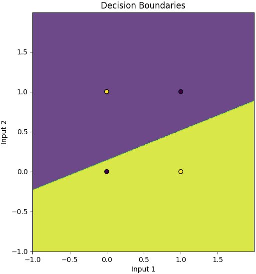
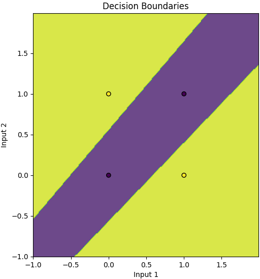
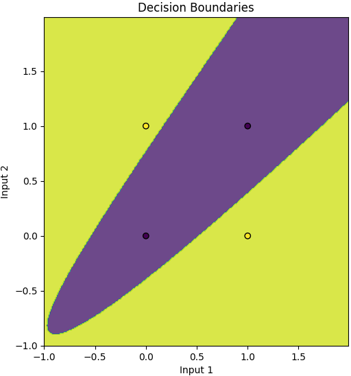
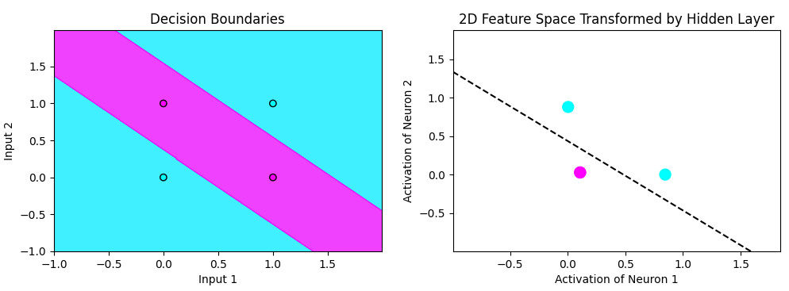
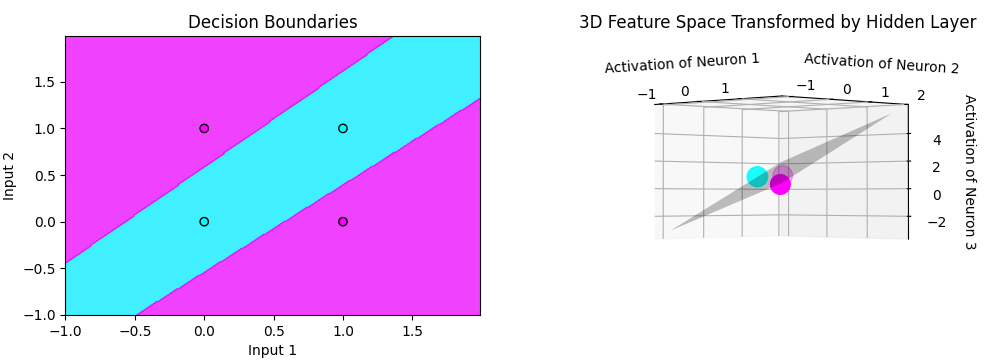
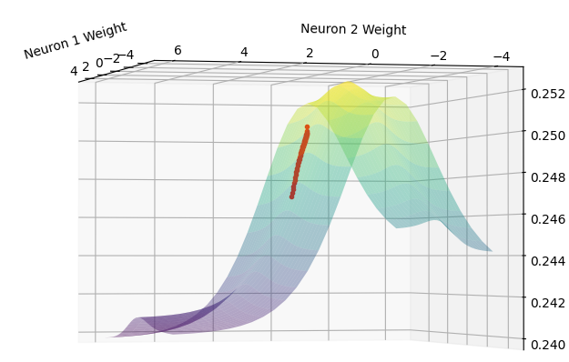
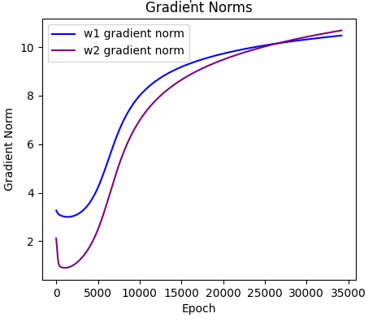

# XOR (Exclusive OR) Problem Neural Network Deep Dive

[](https://www.youtube.com/watch?v=zGUs17-CcHU)

## Table of Contents

- [Preamble](#preamble)
- [Problem Definition](#problem-definition)
- [Problem Solution](#problem-solution)
  - [Conceptual Understanding](#conceptual-understanding)
  - [New Feature: Loss Surface and Weight Trajectory Visualization](#new-feature-loss-surface-and-weight-trajectory-visualization)
  - [Additional New Feature: Gradient Norms](#additional-new-feature-gradient-norms)
- [Architecture](#architecture)
- [Activation Function](#activation-function)
- [Forward Propagation](#forward-propagation)
- [Cost Function / Error](#cost-function--error)
- [Backward Propagation](#backward-propagation)
  - [Output Layer Gradient](#output-layer-gradient)
  - [Hidden Layer Error](#hidden-layer-error)
  - [Parameter Updates](#parameter-updates)
- [Key Takeaways](#key-takeaways)


## Preamble

A neural network is a computational model inspired by the human brain's structure. It consists of layers of interconnected neurons (also called nodes), where each neuron processes input data and passes the result to the next layer. The network learns by adjusting the weights and biases associated with these connections to minimize the difference between its predictions and the actual outputs.

**Please note** All figures and plots shown in this deep dive are screenshots taken directly from the visuals generated in this project, every image below is an image you will be able to see when running. Additionally, some plots are from older versions, so colors, labels, etc. may look a bit different.

## Problem Definition

An XOR logic gate takes two binary inputs and outputs a single binary output as shown in the following truth table:
```
    a   |   b   |   y
-------------------------
    0   |   0   |   0       # if both inputs are false, output is false
    0   |   1   |   1       # if one input is false and one true, output is true
    1   |   0   |   1       # if one input is true and one false, output is true
    1   |   1   |   0       # if both inputs are true, output is false
```

Plotting the inputs and outputs of this truth table results in something like this:



You can see in the above plot, that there is no way to draw a single line to separate the two categories.


## Problem Solution

However if we draw two lines we can separate categories effectively


*Conceptually speaking* the equivalent to drawing two lines is to use two hidden neurons to introduce non linear relationships.

However, we are not technically drawing 2 separate lines, rather having the network transform points to a new 2D space (feature space) where the points *become* linearly separable, and then interpreting this linear separation as it relates to our input space to make a decision (and to visualize the decision boundaries). This mapping is created from the non-linearities of the activation functions. When we interpret the linear decision boundary that was found in this new 2D space as it relates to our original input space, the boundary is now curved and *resembles* a 2nd degree polynomial, however it is technically a linear piecewise function found in the feature space, where each neuron contributes a piece of the piecewise function. This curved decision boundary is better demonstrated in the intermediate training steps as it starts to figure out the solution, where we can see an accurate boundary *starting* to form.



In the figure below we can see the plot showing the network has found a solution and is interpreted in our input space, and how it relates to the feature space where we found a linearly separable solution. 



**Note** 2 of the True outputs (pink) have been transformed such that they essentially overlap eachother.

This visualization works as we are transforming our input space from 2D to another space still in 2D. 

If we used 3 hidden neurons, we'd be transforming the points into 3D and find a plane that separates the points, then interpreting that transformation back in our original 2D input space for an output of the decision. This pattern extends s.t. n hidden neurons will map points to n dimensions.

We can see how 3 hidden neurons gives a 3D feature space below




**New Feature**: Loss Surface and Weight Trajectory Visualization


To gain deeper insights into how our neural network learns to solve the XOR problem, I've added a new visualization feature that plots the loss surface and the trajectory of specific weights during training.





By integrating this new feature, we enhance our understanding of the neural network's learning process. It provides a window into the optimization mechanics, highlighting how specific weights influence the network's ability to minimize loss and solve problems like XOR.

The 3D gradient plot provides a visual representation of the loss surface and the trajectory of specific weights during training, allowing us to interpret how the neural network adjusts its parameters to solve the XOR problem effectively. By plotting the loss as a function of two key weights (w1[0,0] and w1[0,1]), we can observe how changes in these weights impact the overall loss. The surface illustrates the optimization landscape, with peaks and valleys representing areas of high and low loss, respectively. The trajectory overlaid on this surface shows the path the optimizer takes, moving from initial random weights towards the minimum loss region. Interpreting this plot helps us understand the network's learning process: as the weights adjust to minimize loss, the trajectory descends into valleys of the loss surface, indicating improved performance. This visualization connects the mathematical adjustments of weights during training to a tangible depiction of the network's ability to find the optimal parameters that solve the XOR problem, highlighting the effectiveness of gradient descent in navigating the loss landscape towards a solution.

Note: The visualization enhances the existing feature space plots by showing not just the transformation of data points but also how the network adjusts its parameters to achieve that transformation.

**Additional New Feature**: Gradient Norms

We take the norms of the gradients of each layer's weights (except input layer since there are no weights in the input layer). This over time shows how much the weights are changing each epoch, and over time as the network learns and finds a solution, we can see the curve taper off, indicating that the weights are changing less as we approach a minimum. 





**Note** This visual shows for any number of hidden neurons >= 3


Now that we have a conceptual understanding, let's now dive into the math behind this to build the bridge between theory and application.

**Architecture**

Our neural network has the following structure:

- Input Layer: 2 neurons (for inputs $x_1$ and $x_2$)
- Hidden Layer: $n$ neurons (we'll use 3 for demonstration purposes)
- Output Layer: 1 neuron (for the predicted output $\hat{y}$)

This architecture allows the network to capture the non-linear relationships inherent in the XOR problem.


**Activation**

Activation functions introduce non-linearity into the network, enabling it to learn complex patterns by 'activating' the neurons in both the hidden and output layers.
A commonly used activation function for neural networks is the **Sigmoid function**

$$
\sigma(z) = \frac{1}{1 + e^{-z}}
$$


**Forward Propagation**

Forward propagation is the process of calculating the output of the neural network given the inputs. It involves computing the activations of each neuron layer by layer.
For each hidden neuron $h_j$ where j is an index of a hidden neuron, we take the weighted sum of its inputs, which are initialized randomly as small numbers (between 0 and 1) for simplicity.
The weighted sum is as follows:

$$
z_j^{(1)} = w_{j1}^{(1)} x_1 + w_{j2}^{(1)} x_2 + w_{j3}^{(1)} x_3 + b_j^{(1)}
$$

Where:
- $w_{j1}^{(1)}$ is the weight from the input neuron $i$ to hidden neuron $j$
- $b_j^{(1)}$ is the bias term for hidden neuron $j$
- The $1$ superscript is the index of the layer (0 is input, 1 is hidden, 2 is output)

This weighted sum is then passed through the sigmoid activation given above:

$$
a_j^{(1)} = \sigma\left( z_j^{(1)} \right)
$$

From here we have each neuron's activation value. These activated neurons then have a weighted sum again to feed to the output neuron (layer index of 2)

$$
z^{(2)} = \sum_{j=1}^{n=3} w_j^{(2)} a_j^{(1)} + b^{(2)}
$$

And once again this weighted sum is then activated to give us a final output prediction value, which ideally is close to 1 or 0 (True or False)

$$
\hat{y} = \sigma\left( z^{(2)} \right)
$$


**Cost Function / Error**

The cost function quantifies the error between the network's predictions and the actual outputs. We use the Mean Squared Error (MSE):

$$
J = \frac{1}{2} (\hat{y} - y)^2
$$

Where $y$ is the actual output (aka ground truth) and $\hat{y}$ is the predicted value


**Backward Propagation**

Backward propagation calculates the gradients of the cost function with respect to each weight and bias, allowing us to individually update them in a way that minimizes the cost.


1. Output Layer Gradient
The output neuron gradient quantifies how far off out predicted output is from the actual output

$$
\delta^{(2)} = (\hat{y} - y) \cdot \sigma'\left( z^{(2)} \right)
$$

Where $\sigma'\left( z^{(2)} \right)$ is the derivative of the sigmoid function evaluated at $z^{(2)}$ given as:

$$
\sigma'(z) = \sigma(z) (1 - \sigma(z))
$$

Now with the error we can find the gradient of the output layer. The gradient of the cost function w.r.t the output weight $w_j^{(2)}$ and bias $b^{(2)}$ is as follows:

$$
\frac{\partial J}{\partial w_j^{(2)}} = \delta^{(2)} \cdot a_j^{(1)}
$$

$$
\frac{\partial J}{\partial b^{(2)}} = \delta^{(2)}
$$


2. Hidden Layer Error
The error term for each hidden neuron $h_j$ is influenced by the errors in the subsequent layer:

$$
\delta_j^{(1)} = \delta^{(2)} \cdot w_j^{(2)} \cdot \sigma'\left( z_j^{(1)} \right)
$$

And again let's find the gradient of now the hidden layer weights and biases similarly to how we did for the ouput layer.

$$
\frac{\partial J}{\partial w_{ji}^{(1)}} = \delta_j^{(1)} \cdot x_i 
$$

$$
\frac{\partial J}{\partial b_j^{(1)}} = \delta_j^{(1)}
$$


3. Parameter Updates
With the gradients calculated, we use Gradient Descent to update the parameters of our network. This is best thought of as takking a small step down towards a minimum in the gradient. Keep in mind these gradients generate a sort of wavy surface, where we want to be as low as possible in. The lower we are in this gradient, the less error we have.

$$
\theta \leftarrow \theta - \eta \frac{\partial J}{\partial \theta}
$$

Where $\theta$ represents some weight or bias in the network, and $\eta$ is the learning rate, which controls how big of a step we take

More explicitly:

$$
w_j^{(2)} \leftarrow w_j^{(2)} - \eta \frac{\partial J}{\partial w_j^{(2)}}
$$

The same process follows for the bias:

$$
b^{(2)} \leftarrow b^{(2)} - \eta \frac{\partial J}{\partial b^{(2)}}
$$

We then repeat this step for the hidden neurons as well:

$$
w_{ji}^{(1)} \leftarrow w_{ji}^{(1)} - \eta \frac{\partial J}{\partial w_{ji}^{(1)}} 
$$

$$
b_j^{(1)} \leftarrow b_j^{(1)} - \eta \frac{\partial J}{\partial b_j^{(1)}}
$$

By integrating these mathematical principles into our code, we create a neural network that effectively learns to solve the XOR problem. Understanding the math behind the network not only demystifies how neural networks function but also empowers you to modify and extend the network for more complex tasks.

**Key Takeaways**
- Learning: The network learns by adjusting weights and biases to minimize the cost function.
- Error Signals: Errors are propagated backward to update parameters in earlier layers.
- Non-Linear Transformation: Hidden layers transform inputs into a space where linear separation is possible.
- Optimization: Gradient descent is used to find the set of parameters that minimize the cost.

